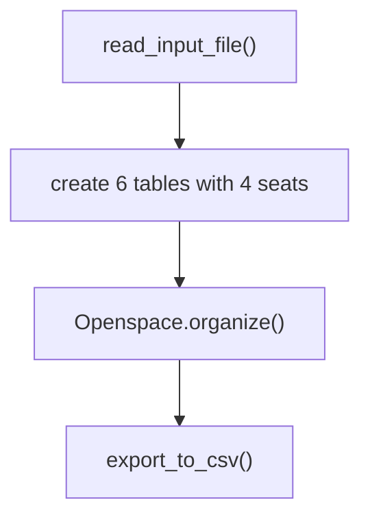
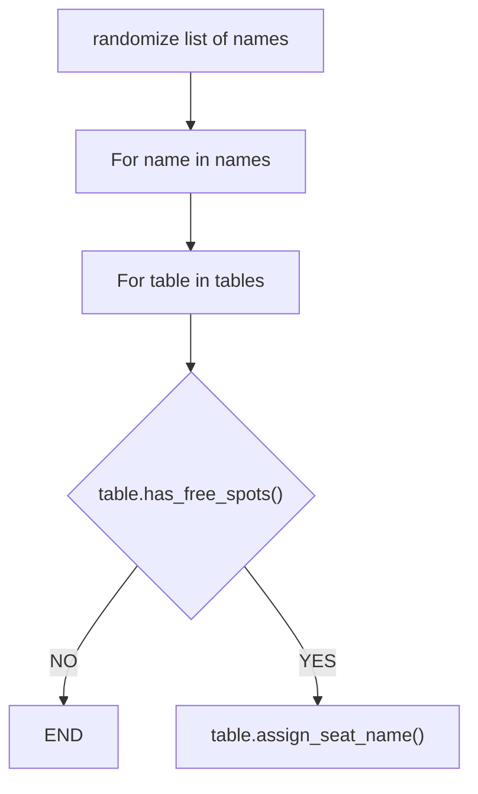

# Open space organizer
This project contains an algorithm that randomly assign people to a spot in the openspace.

The default setup of the open space is 6 tables of 4 seats → 24 seats.

# Workflow


## High level flow chart:




## Flow chart of the Openspace.organize() algorithm:



# Installation

* clone the repo
* fill new_colleagues.txt with the names of the people in the openspace or create your own txt file under the data folder. (each name should be on a new line)


```bash
$ python3 main.py
```

* you will be asked to type the filename of the txt file that contains the names of the people in the openspace. In case you did not create your own file, `new_colleagues.txt` should be typed.

### Result
Find the result in the organized_openspace.csv file in the data folder.

# Usage

The program reads data from a txt file that contains all the names of people in the openspace. The program then randomly assigns each person to a spot in the openspace and writes the output to a csv file.

# Timeline

This project was created in two days

# Personal situation

This project was made as an assignment in the BeCode course: Data AI operator.

