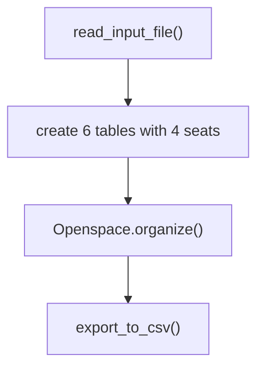
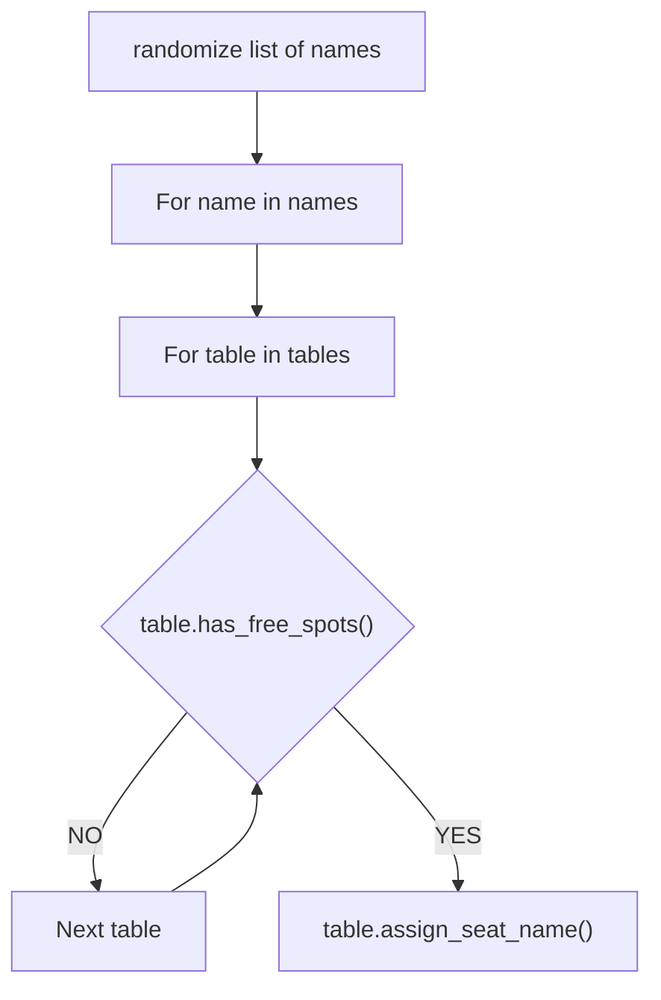

# Open space organizer

[](https://www.python.org/)


Our company moved to a new office. It's an openspace with a default setup of 6 tables that have each 4 seats (24 seats in total).

The company consists out of a team of new colleagues, so we came up with the idea of changing seats everyday to get to know each other better by working side by side with new colleagues.

This project contains an algorithm that randomly assign people to a spot in the openspace.

# Workflow

## High level flow chart:




## Flow chart of the Openspace.organize() algorithm:



# Installation

* clone the repo
* fill new_colleagues.txt with the names of the people in the openspace or create your own txt file under the data folder. (each name should be on a new line)


```bash
$ python3 main.py
```

* You can use your own file that you store in the data folder. Each name should be on a new line.
* In case you want to use your own file, you are able to provide a filename as an argument. 
* In case you do not supply a filename, the defaultfile will be used: `./data/new_colleagues.txt`

### Result
Find the result in the organized_openspace.csv file in the data folder.

# Usage

The program reads data from a txt file that contains all the names of people in the openspace. The program then randomly assigns each person to a spot in the openspace and writes the output to a csv file.

# Timeline

This project was created in two days

# Personal situation

This project was made as an assignment in the BeCode course: Data AI operator.

