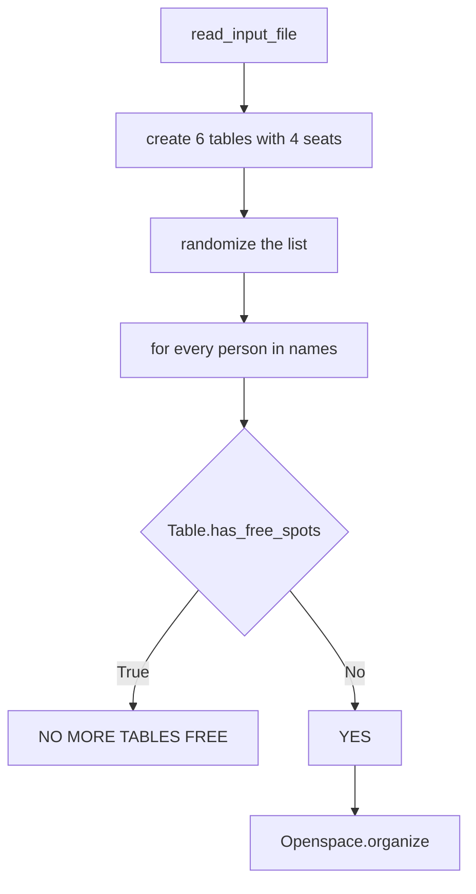
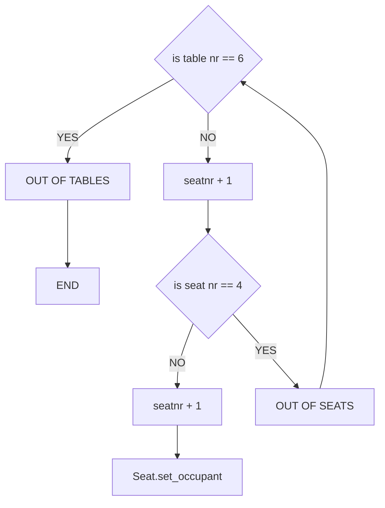

# Open space organizer
This project contains an algorithm that randomly assign people to a spot in the openspace.

The default setup of the open space is 6 tables of 4 seats → 24 seats.

# Workflow

## High level flow chart:

## Flow chart of the organize algorithm:

# Installation

# Usage

The program reads data from a txt file that contains all the names of people in the openspace. The program then randomly assigns each person to a spot in the openspace.

# Timeline

# Personal situation

This project was made as an assignment in the BeCode course: Data AI operator.

### to cover in this README file:
(Visuals)
(Contributors)

